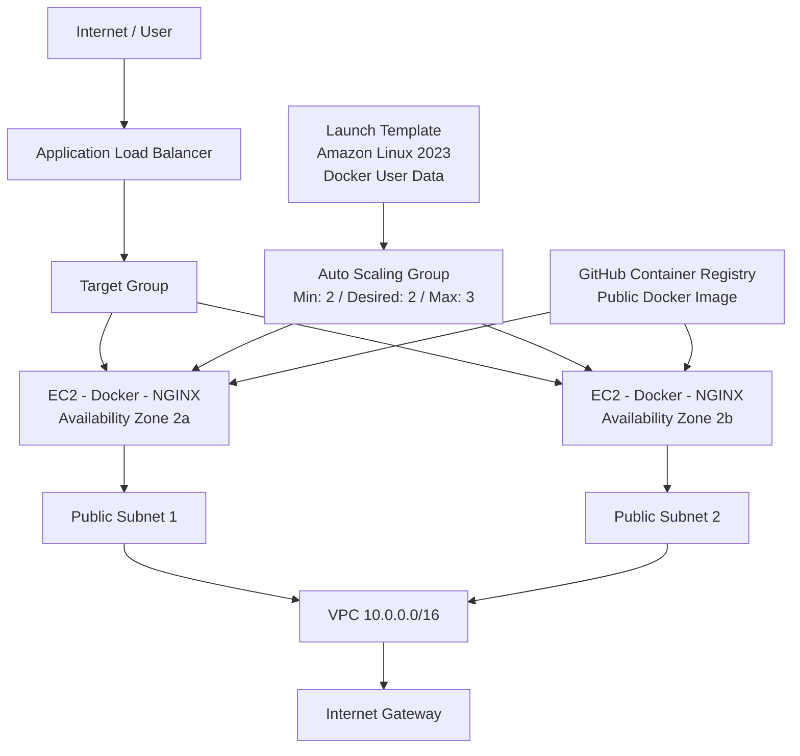

# AWS Auto-Healing Web Tier

This project deploys a highly available and self-healing web tier on AWS using Terraform.

The solution runs NGINX across two EC2 instances managed by an Auto Scaling Group and distributes incoming HTTP traffic through an Application Load Balancer.

If an instance is terminated or becomes unhealthy, the Auto Scaling Group automatically launches a replacement.

## Architecture



## Architecture Flow

The Application Load Balancer is the public entry point for the application. HTTP traffic is forwarded to healthy EC2 instances registered with the target group.

The Auto Scaling Group maintains a desired capacity of two EC2 instances across two Availability Zones. If an instance is terminated or becomes unhealthy, the Auto Scaling Group launches a replacement using the Launch Template.

Each EC2 instance is automatically configured using user data. The bootstrap script installs and starts Docker, pulls the public NGINX container image from GitHub Container Registry (GHCR), and runs the container on port 80.

The Docker image contains the custom static web page and is published at:

`ghcr.io/manjusam/auto-healing-web:latest`

The EC2 security group accepts HTTP traffic only from the Application Load Balancer security group, rather than allowing direct HTTP access from the internet.

The overall traffic flow is:

```text
Internet
    |
    v
Application Load Balancer
    |
    v
Target Group
   / \
  v   v
EC2   EC2
2a    2b
```

## Why AWS?

AWS was selected for this assessment because I have an existing foundation in AWS from completing the AWS re/Start program.

This made AWS a natural choice for demonstrating the solution while also building further hands-on experience with AWS infrastructure and Terraform.

AWS provides the services required for the architecture, including EC2, Application Load Balancing, Auto Scaling, VPC networking and health monitoring.

## Key Components

- **VPC** – Provides the network boundary for the infrastructure.

- **Public Subnets** – Two subnets across `ap-southeast-2a` and `ap-southeast-2b` provide multi-AZ availability.

- **Internet Gateway and Route Table** – Provide internet connectivity for resources in the public subnets.

- **Application Load Balancer (ALB)** – Provides a single public endpoint and distributes HTTP traffic across healthy EC2 instances.

- **Listener** – Listens for HTTP traffic on port 80 and forwards requests to the target group.

- **Target Group** – Contains the backend EC2 instances and performs HTTP health checks on `/`.

- **Security Groups** – The ALB accepts HTTP traffic from the internet, while the EC2 instances accept HTTP traffic on port 80 only from the ALB security group.

- **Launch Template** – Defines how EC2 instances are created, including the Amazon Linux 2023 AMI, instance type, security group and user data.

- **User Data** – Automatically installs and starts Docker, pulls the public container image from GHCR, and runs the NGINX container on port 80 whenever a new EC2 instance is launched.

- **Docker** – Packages NGINX and the custom static web page into a consistent container image.

- **GitHub Container Registry (GHCR)** – Stores the public Docker image at `ghcr.io/manjusam/auto-healing-web:latest`, allowing new EC2 instances to pull the image without storing GitHub credentials on the instances.

- **Auto Scaling Group (ASG)** – Maintains the required EC2 capacity and automatically launches replacement instances when necessary.

- **AWS Systems Manager Parameter Store** – Used to retrieve the Amazon Linux 2023 AMI rather than hard-coding a specific AMI ID.

- **Terraform Variables** – Make settings such as AWS region, Availability Zones, instance type and Auto Scaling capacity configurable.

- **Terraform Output** – Returns the Application Load Balancer DNS name used to access the website.

## Design Decisions

### Multi-AZ Deployment

The web tier uses two Availability Zones:

```text
ap-southeast-2a
ap-southeast-2b
```

The Auto Scaling Group has the following capacity configuration:

```text
Minimum capacity: 2
Desired capacity: 2
Maximum capacity: 3
```

Maintaining two instances provides N+1 capacity so that the web tier does not depend on a single EC2 instance.

### Load Balancer as the Public Entry Point

Users access the application through a single Application Load Balancer DNS endpoint.

The individual EC2 instances do not need separate application URLs. The ALB distributes requests between healthy instances registered with the target group.

### Security

Separate security groups are used for the Application Load Balancer and EC2 instances.

The ALB security group allows inbound HTTP traffic on port 80 from the internet.

The EC2 security group allows inbound HTTP traffic on port 80 only from the ALB security group.

This creates the intended traffic path:

```text
Internet -> ALB -> EC2
```

### Public Subnets

For this assessment, the EC2 instances are deployed in public subnets to keep the architecture simple and avoid the additional cost of a NAT Gateway.

Although the instances are located in public subnets, their EC2 security group restricts inbound HTTP traffic to the Application Load Balancer security group.

For a production architecture, private subnets for application instances would normally be considered depending on the application and security requirements.

### Dynamic Amazon Linux AMI

The Amazon Linux 2023 AMI is retrieved using the AWS Systems Manager public parameter rather than hard-coding an AMI ID.

This reduces the need to manually maintain region-specific AMI IDs in the Terraform configuration.

## How Self-Healing Works

The Auto Scaling Group maintains a desired capacity of two EC2 instances.

If an instance is terminated or becomes unhealthy, the Auto Scaling Group launches a replacement using the Launch Template.

The replacement process is:

```text
Instance terminated / unhealthy
          |
          v
Auto Scaling Group detects the issue
          |
          v
Launch Template
          |
          v
New EC2 instance
          |
          v
User data installs and starts Docker
          |
          v
Docker pulls the public image from GHCR
          |
          v
NGINX container starts on port 80
          |
          v
Target Group health check
          |
          v
Instance becomes healthy
          |
          v
ALB can send traffic to the instance
```

While the replacement instance is being created and becoming healthy, the remaining healthy instance can continue receiving traffic through the Application Load Balancer.

During validation, one EC2 instance was manually terminated. The Auto Scaling Group automatically launched a replacement instance, and the replacement subsequently passed the target group's health checks.

## Terraform Files

The Terraform configuration is separated into files based on responsibility:

```text
.
├── main.tf
├── variables.tf
├── vpc.tf
├── security_groups.tf
├── alb.tf
├── launch_template.tf
├── autoscaling.tf
├── outputs.tf
├── Dockerfile
└── index.html
```

- `main.tf` – Terraform and AWS provider configuration.
- `variables.tf` – Configurable values used by the infrastructure.
- `vpc.tf` – VPC, subnets, Internet Gateway and routing.
- `security_groups.tf` – ALB and EC2 security groups.
- `alb.tf` – Application Load Balancer, listener and target group.
- `launch_template.tf` – EC2 Launch Template, Amazon Linux AMI lookup and user data used to install Docker and run the container image.
- `autoscaling.tf` – Auto Scaling Group configuration.
- `outputs.tf` – Application Load Balancer DNS output.
- `Dockerfile` – Defines the NGINX container image and copies the custom static web page into the image.
- `index.html` – Custom static web page served by NGINX.

## Docker Bonus

The web application is containerised using Docker rather than installing NGINX directly on the EC2 instances.

The `Dockerfile` uses the lightweight `nginx:alpine` base image and copies the custom `index.html` page into the NGINX web root.

```dockerfile
FROM nginx:alpine

COPY index.html /usr/share/nginx/html/index.html
```

The image was built and tested locally before being published to GitHub Container Registry (GHCR).

```bash
docker build -t auto-healing-web .
docker run -d -p 8080:80 --name auto-healing-test auto-healing-web
```

The container image is published as a public package:

```text
ghcr.io/manjusam/auto-healing-web:latest
```

The EC2 Launch Template uses user data to automatically:

1. Install Docker.
2. Enable and start the Docker service.
3. Pull the public image from GHCR.
4. Run the container with host port 80 mapped to container port 80.

Because the GHCR package is public, the EC2 instances can pull the image without storing GitHub credentials or a Personal Access Token on the instances.

The container is started with `--restart unless-stopped` so that Docker can automatically restart the application container following a Docker service or instance restart unless the container has been explicitly stopped.

## Prerequisites

The following tools are required:

- Terraform
- AWS CLI
- Git
- An AWS account with appropriate permissions

AWS credentials should be configured locally before running Terraform.

The default deployment region for this project is:

```text
ap-southeast-2
```

## Deployment

Clone the repository and change into the project directory.

Initialize Terraform:

```bash
terraform init
```

Format the Terraform configuration:

```bash
terraform fmt
```

Validate the configuration:

```bash
terraform validate
```

Review the infrastructure Terraform intends to create:

```bash
terraform plan
```

Deploy the infrastructure:

```bash
terraform apply
```

Review the proposed changes and enter:

```text
yes
```

when prompted.

After a successful deployment, Terraform outputs the Application Load Balancer DNS name:

```text
alb_dns_name = "..."
```

The value can also be retrieved using:

```bash
terraform output -raw alb_dns_name
```

Open the ALB DNS name using HTTP in a web browser to view the custom NGINX web page running from the Docker container.

## Validation

The deployed infrastructure was tested to verify availability, self-healing and Terraform idempotency.

### N+1 Capacity

After deployment, the Auto Scaling Group contained two healthy EC2 instances in separate Availability Zones.

```text
EC2 Instance 1 -> Healthy -> InService -> ap-southeast-2a
EC2 Instance 2 -> Healthy -> InService -> ap-southeast-2b
```

### Load Balancer Health

Both EC2 instances successfully passed the Application Load Balancer target group health checks.

```text
EC2 Instance 1 -> healthy
EC2 Instance 2 -> healthy
```

### Self-Healing Test

One EC2 instance was manually terminated to simulate the loss of a VM.

The Auto Scaling Group detected the capacity/health change and automatically launched a replacement instance.

The replacement instance:

1. Was created using the Launch Template.
2. Started Amazon Linux 2023.
3. Executed the user-data bootstrap script.
4. Installed and started NGINX.
5. Registered with the target group.
6. Passed the target group health checks.
7. Returned the Auto Scaling Group to two healthy instances.

The Auto Scaling activity history confirmed that a new instance was launched in response to the terminated instance.

### Docker Deployment Validation

After the Docker image was published to GHCR, the Launch Template user data was updated to install Docker, pull the public image and run the NGINX container.

The existing EC2 instances were replaced one at a time so that a healthy instance remained available behind the Application Load Balancer during each replacement.

After replacement:

```text
EC2 Instance 1 -> Healthy -> InService -> ap-southeast-2a
EC2 Instance 2 -> Healthy -> InService -> ap-southeast-2b
```

Both replacement instances passed the target group health checks.

The Application Load Balancer successfully served the custom containerised web page:

```text
AWS Auto-Healing Web Tier
Running on NGINX in Docker
Provisioned with Terraform
```

This verified that new instances can bootstrap automatically, retrieve the public container image from GHCR, run NGINX in Docker and become healthy targets behind the load balancer.

### Terraform Idempotency

After the self-healing process completed, another Terraform plan was executed.

Terraform returned:

```text
No changes. Your infrastructure matches the configuration.
```

This demonstrates that the Terraform configuration remained aligned with the desired infrastructure state after the Auto Scaling Group replaced the terminated EC2 instance.

## Cost Considerations

This architecture was designed primarily to demonstrate the availability and self-healing requirements of the assessment.

The approximate monthly cost for running the complete environment continuously in the Sydney (`ap-southeast-2`) region is:

| Resource | Configuration | Approximate Monthly Cost (USD) |
|---|---|---:|
| EC2 | 2 × `t3.micro` Linux instances | ~$19 |
| Application Load Balancer | 1 ALB, before significant LCU usage | ~$18+ |
| Public IPv4 | Public addresses used by EC2/ALB | ~$14 |
| EBS | Root volumes for two EC2 instances | ~$2 |
| **Estimated total** | Light assessment traffic | **~$53+ USD/month** |

This is approximately **AUD 70–80 per month**, depending on the USD/AUD exchange rate, traffic, taxes and other usage-based charges.

The estimate assumes that the infrastructure runs continuously for approximately 730 hours per month with light assessment traffic. Application Load Balancer LCU usage and data transfer can increase the final cost.

The complete architecture therefore exceeds the assessment target of AUD 20 per month when operated continuously.

The main reason is that the assessment requires N+1 capacity with at least two instances behind a load balancer. The Application Load Balancer and public IPv4 addressing also introduce fixed ongoing costs.

For this assessment, the environment is intended to be short-lived. It is deployed only for implementation and validation and is destroyed afterward using Terraform to avoid unnecessary ongoing charges.

A production deployment would require a separate cost optimisation exercise based on availability, security, traffic and workload requirements.

## Assumptions

- HTTP is sufficient for the assessment; HTTPS and certificates are outside the current scope.
- A custom static NGINX page running in Docker is used to demonstrate the web tier.
- Two EC2 instances satisfy the required N+1 capacity for this assessment.
- EC2 instances are deployed in public subnets to simplify the assessment architecture and avoid NAT Gateway cost.
- The environment is intended for demonstration/testing rather than continuous production use.
- Terraform is the source of truth for infrastructure configuration.

## Cleanup

To prevent unnecessary AWS charges after testing, destroy the Terraform-managed infrastructure:

```bash
terraform destroy
```

Review the resources Terraform intends to remove and enter:

```text
yes
```

when prompted.

After completion, Terraform should report that the managed resources have been destroyed.

## Summary

This project demonstrates an AWS web tier that is:

- Provisioned entirely using Terraform.
- Distributed across two Availability Zones.
- Load balanced through an Application Load Balancer.
- Protected using separate ALB and EC2 security groups.
- Maintained by an Auto Scaling Group with a desired capacity of two instances.
- Able to automatically replace a terminated or unhealthy instance.
- Containerised using Docker and NGINX.
- Automatically bootstrapped using EC2 user data.
- Able to pull the public Docker image from GitHub Container Registry (GHCR) and run it on newly launched instances.
- Verified with two healthy Docker-based EC2 targets behind the Application Load Balancer.
- Idempotent, with the final `terraform plan` returning no infrastructure changes.